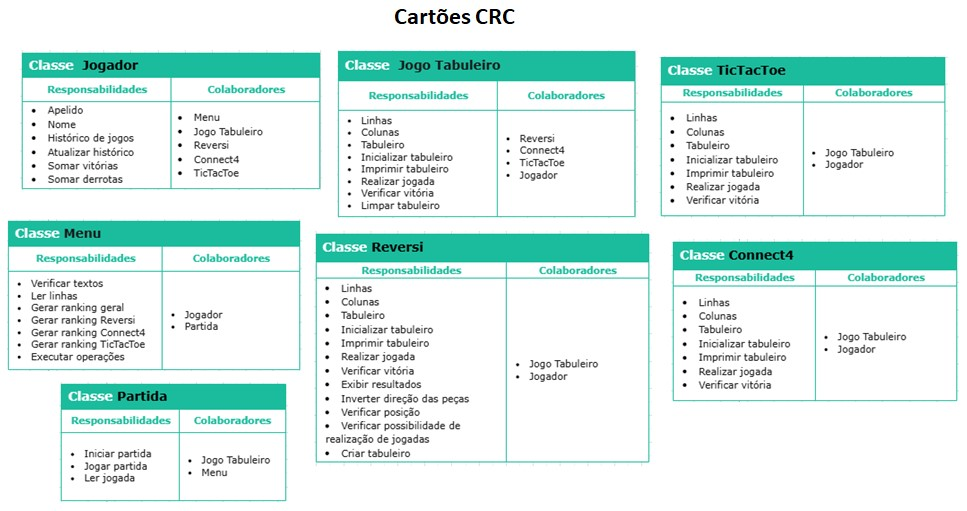

# Projeto Final

Esse é um projeto criado para a disciplina de Programação e Desenvolvimento de Softwares 2 da UFMG. O projeto consiste em um jogo implementado em C++ utilizando conceitos aprendidos durante o semestre da disciplina, o projeto conta com o desenvolvimento de três jogos 'TicTacToe', 'ConnectFour' e 'Reversi'.


## 🚀 Começando

Essas instruções permitirão que você obtenha uma cópia do projeto em operação na sua máquina local para fins de desenvolvimento e teste.

Consulte **[Implantação](#-implanta%C3%A7%C3%A3o)** para saber como implantar o projeto.


### 👋 Pré-requisitos

Para rodar o projeto, você precisará de:

```
- C++ (recomenda-se a versão 11 ou superior)
- CMake para gerenciamento da build
- Um compilador compatível (g++, Clang ou MSVC)
```


### 🔧 Instalação

Para instalar e configurar o ambiente de desenvolvimento, siga os passos abaixo:

1. Clone o repositório:

```
git clone https://github.com/seu_usuario/projeto_final.git
```

2. Entre no diretório do projeto:

```
cd projeto-final
```

3. Configure a build com CMake:

```
mkdir build
cd build
cmake ..
```

4. Compile o projeto:

```
make
```

5. Execute o jogo:

```
./jogo
```


## ⚙️ Executando os testes

Para rodar os testes automatizados do sistema, utilize:

```
make test
```


### 👩‍💻 Analise os testes de ponta a ponta

Os testes verificam a funcionalidade das classes principais do jogo, garantindo que as regras sejam seguidas corretamente.

```
./run_tests
```


## 📦 Implantacão

Para implantar o projeto em um sistema ativo, compile o binário e distribua o executável junto com os arquivos de configuração necessários.


## 🛠️ Construído com

* [C++] - Linguagem principal do projeto
* [CMake] - Ferramenta para geração da build
* [doctest] - Framework de testes unitários


## 📌 Branches e Commits

Utilizamos um sistema simplificado de branches:
- **dev**: desenvolvimento de novas funcionalidades.
- **fix**: correção de bugs e ajustes.
- **pattern**: estruturação e organização do projeto.

Além disso, seguimos o padrão [Conventional Commits](https://www.conventionalcommits.org/) e utilizamos o [Gitmoji](https://gitmoji.dev) para facilitar a identificação dos commits.


## 📂 Estrutura de Pastas

```
.
├── bin                     # Arquivos binários compilados
├── include                 # Arquivos de cabeçalho (headers)
├── obj                     # Objetos compilados
├── src                     # Arquivos com os códigos fontes principais
│   ├── data                # Dados do jogo
├── tests                   # Testes unitários
├── .gitignore              # Arquivo de configuração do Git
├── LICENSE                 # Licença do projeto
├── README.md               # Documentação do projeto
├── Makefile                # Configuração para build
```


## 🃏 Cartões CRC

Os cartões CRC (Classe-Responsabilidade-Colaborador) ajudam a visualizar a estrutura das classes e suas interações no projeto. Abaixo está a imagem contendo os cartões CRC utilizados:



Esses cartões representam a relação entre as classes, suas responsabilidades e seus colaboradores, garantindo uma organização clara do projeto.


## ✨ Autores

* **Ana Carolina Carvalho Martins** - [github_link](https://github.com/carolcarvalho-27)
* **Gabriel Abílio Barbosa Ferreira** - [github_link](https://github.com/g-abilio)
* **Gustavo Rodrigues Monteiro** - [github_link](https://github.com/grmonteiroh)


## 📝 Licença

Este projeto está sob a licença MIT - veja o arquivo [LICENSE](https://github.com/seu_usuario/projeto_final/LICENSE) para detalhes.